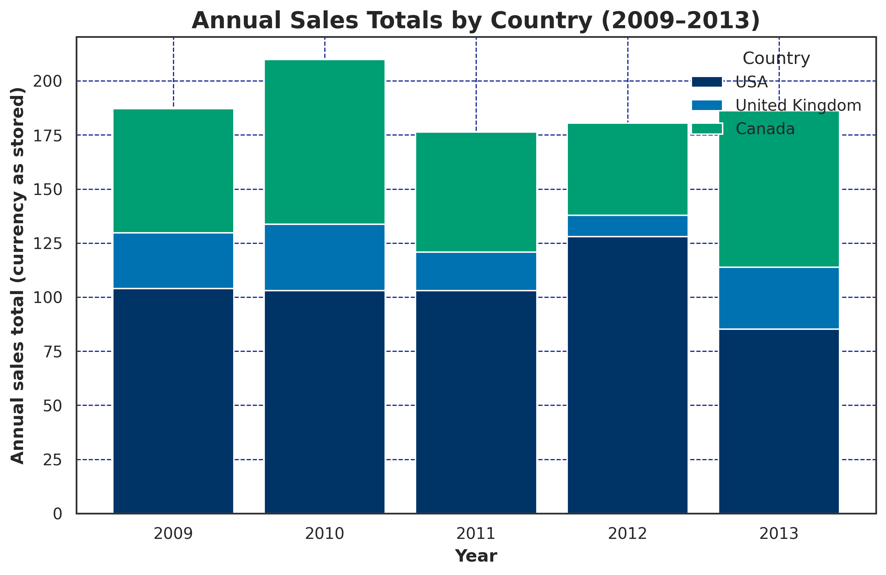
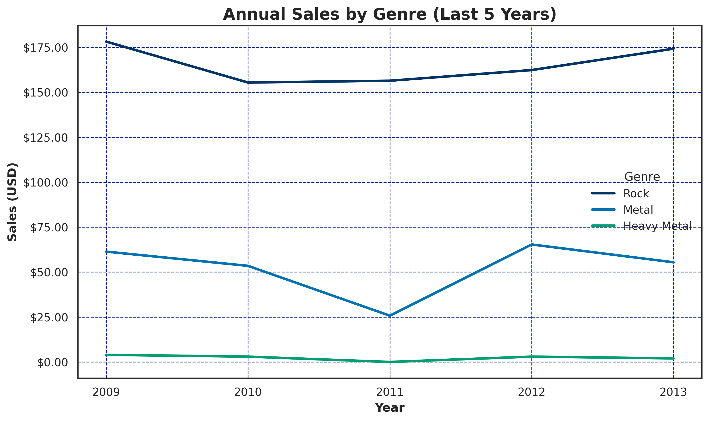

# Autonomous AI Agents for data analysis and visualization
A multi-agent system where user can request for analysis over a SQL database using a prompt. A data analysis agent returns the analyzed data and a data visualization agent generates a visualization. User can specify the type of visualization (line, bar, scatter, multi line, etc.). The agents are controlled through a simple command-line interface and the generated visualizations follows a pre-defined design template.

## Some examples
The example uses the chinook sqlite database taken from [here](https://www.timestored.com/data/sample/sqlite).

| User prompt | Generated visualization |
|------------|-------|
| Tabulate the annual sales in USA, United Kingdom, and Canada. Visualization type: Stacked bar chart. |  |
| Tabulate the sales of rock, metal and heavy metal genre music year wise in the last 5 years. Visualization type: Multi Line. |  |


## Environment and AI agent framework used
* Ubuntu 24.04 (WSL2)
* Python 3.12
* LangChain
* GPT-5 (Open AI API key required)

## Set up
1. Download the database.
```bash
mkdir database
cd database/
wget https://www.timestored.com/data/sample/chinook.db
wget https://www.timestored.com/data/sample/sakila.db
cd ..
```
2. Create a virtual environment (recommended).
```bash
python -m venv agent
source agent/bin/activate
```
3. Install LangChain and other dependencies.
```bash
pip install langchain  langgraph  langchain-community
pip install -U "langchain[openai]"
pip install matplotlib pandas numpy seaborn
```
4. Set up the OpenAI API key.
```bash
export OPENAI_API_KEY="[INSERT YOUR API KEY]"
curl https://api.openai.com/v1/models   -H "Authorization: Bearer $OPENAI_API_KEY"
```

## How to use the agent?
Run `python main.py`.   
* Available users: admin, client1, client2, client3  
* Available databases: chinook, northwind_small, sakila
* Refer `database_config.py` for details on users and databases. The user "admin" has access to all databases.
* Example use-case:
    * user: admin
    * database: chinook
    * question: "Tabulate the sales of artist AC/DC in the last 5 years. Visualization type: Line."
* The analyzed data will be displayed on the command-line interface and the generated visualization will be stored inside `visualization/` directory.

## Run automated test
Some sample automated test scripts are provided to check the functionality and correctness of the agents. For example:
* Run a test using the following command.   
`python -m test.test5`
* First it will display the user prompt and the expected correct analysis.
* Then the agents will return its analysed data and generate the visualization (stored in `visualization/`).

## How to add new database?
1. Download it inside `database/` directory.
```bash
cd database/
wget https://www.timestored.com/data/sample northwind_small.sqlite
```
2. Update `database_config.py` with DATABASES and USER_DB_ACCESS dictionary.

## How to change the visualization template?
Just modify the `visualization/company_template.py` script with your design color and font choice.
